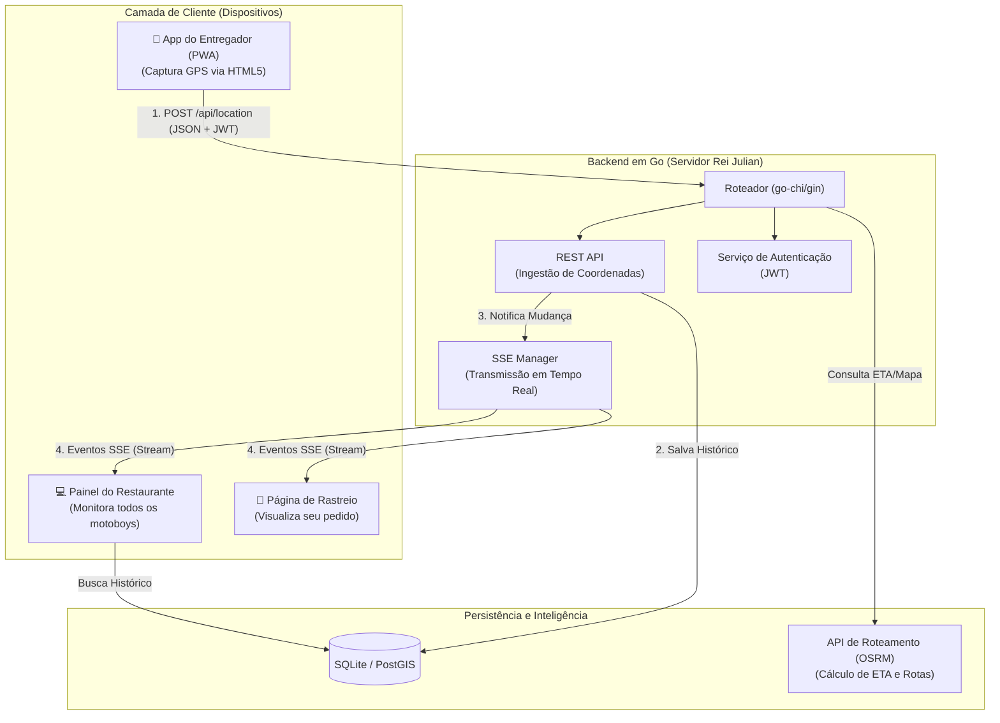

# Roadmap do Projeto: Rei Julian - Sistema de Delivery

Este documento descreve as fases de evolução do projeto, saindo de um protótipo de simulação para um ecossistema logístico real para restaurantes.

---

## 🏗️ Arquitetura do Sistema

Abaixo, o diagrama que ilustra a comunicação entre os diferentes componentes do ecossistema:

### Fluxo de Funcionamento:
1.  **Entregadores:** Enviam sua posição real via uma interface web simples no celular (PWA).
2.  **Servidor Central (Go):** Valida a identidade do entregador (JWT), persiste a coordenada no banco de dados para auditoria e repassa a informação instantaneamente via SSE.
3.  **Visualização (Dashboards):** O restaurante e o cliente final recebem atualizações sem recarregar a página (Real-time).
4.  **Inteligência Geográfica:** Futura integração com OSRM para cálculo preciso de tempo de chegada (ETA) e rotas otimizadas.

---

## 🟢 Fase 1: Fundação e Simulação (Concluída)
- [x] Backend em Go com suporte a SSE (*Server-Sent Events*).
- [x] Motor de simulação matemática (Trigonometria Esférica).
- [x] Frontend básico com Leaflet e OpenStreetMap.
- [x] Documentação inicial (`GEMINI.md`).

## 🟡 Fase 2: Infraestrutura Multi-Usuário e Persistência (Próximos Passos)
O objetivo aqui é permitir que o sistema suporte múltiplos entregadores e pare de "esquecer" os dados ao reiniciar.

- **Persistência de Dados:**
  - Implementar **SQLite** (inicialmente) ou **PostgreSQL** para armazenar coordenadas.
  - Criar tabelas para `entregadores`, `pedidos` e `historico_posicoes`.
- **Refatoração do Backend:**
  - Migrar para um roteador mais robusto (ex: `go-chi` ou `gin`).
  - Implementar suporte a múltiplos `Trackers` (um para cada motoboy ativo).
- **API de Ingestão:**
  - Criar endpoint `POST /api/location` para receber coordenadas reais via JSON.

## 🟠 Fase 3: Interface do Entregador e Segurança
Transformar o rastreamento em algo prático para quem está na rua.

- **Web App do Entregador (PWA):**
  - Interface simples com botão "Ficar Online" e "Iniciar Entrega".
  - Uso da **HTML5 Geolocation API** para capturar o GPS real do celular.
- **Segurança:**
  - Implementação de **JWT (JSON Web Tokens)** para autenticação de entregadores.
  - Proteção de rotas administrativas.

## 🔴 Fase 4: Inteligência Logística e Experiência do Cliente
A fase de "polimento" e valor agregado ao negócio.

- **Painel Administrativo (Dashboard):**
  - Visualização de todos os motoboys no mapa simultaneamente.
  - Status de entrega (Disponível, Em Rota, Retornando).
- **Link de Rastreamento do Cliente:**
  - Página pública `/track/{order_id}` com acesso temporário.
  - Cálculo de **ETA (Tempo Estimado de Chegada)** usando a API do **OSRM**.
- **Histórico de Rotas:**
  - Visualização de trajetos passados para auditoria e otimização de tempo.

---

## 🛠 Stack Tecnológica Definida
- **Linguagem:** Go (Golang)
- **Banco de Dados:** SQLite (Desenvolvimento) / PostgreSQL (Produção)
- **Comunicação:** SSE (Dashboard/Cliente) e REST (Entregador)
- **Mapa:** Leaflet.js + OpenStreetMap
- **Estilização:** CSS Moderno (Vanilla)
